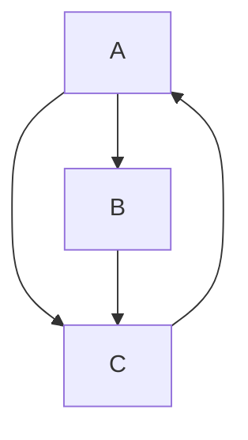

# 隣接行列

以下のような有向グラフがある。



Python の2次元配列を用いて辺の有無を表現すると以下の通り。

```python
E = [
    [False, True, True],
    [False, False, True],
    [True, False, False]
]
```

無向グラフの場合は i, j が True な場合に j, i を True になればいい。
